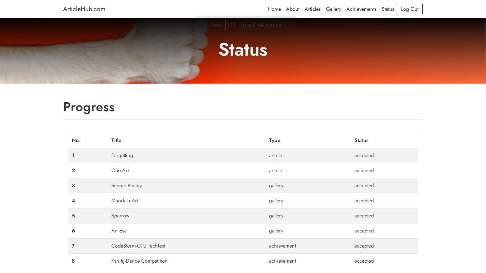

# ArticleHub - An E-magazine
### Introduction of the Website
The ArtHub.com, an E-Magazine System allows the registered members to   submit articles online which will be validated by the moderator and then posted. Guests can view the posted articles and members can view and post the articles.
### Webpages of ArticleHub
####  Index page
</img>

#### About 
</img>
</img>
</img>

#### Articles 
It displays titles of articles submitted which are accepted by the moderator. On clicking the titles, the articles body will be displayed.
It also contains an option to upload articles only if the user is logged in.
  
</img>

  
 ###### Upload Article Dialog Box
 </img>

#### Gallery 
It displays titles and captions of images submitted which are accepted by the moderator.
It also contains an option to upload picture only if the user is logged in.
</img>
 ###### Upload Article Dialog Box
</img>

#### Achievements 
It displays events, its description and image of a student.
It also contains an option to upload an achievement only if the user is logged in.
</img>

#### Status 
It shows the status of the item uploaded by the student.
</img>

#### LogIn 
</img>
#### SignUp 
</img>

### References and Bibliography
- https://www.w3schools.com/css/
- https://www.tutorialspoint.com/
- https://htmldog.com/
- https://www.allphptricks.com/insert-view-edit-and-delete-record-from-database-using-php-and-mysqli/
- https://dev.mysql.com/doc/refman/8.0/en/database-use.html
